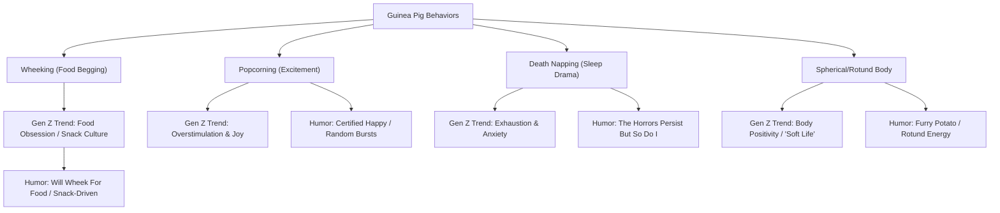

# MASTER WORKFLOW CONTEXT

## 🐹 The Seed (Animal)
**Guinea Pig**

---

## 🎭 Cultural Vibe
- **"The Horrors Persist But So Do I"** — THE defining guinea pig meme. A guinea pig in pink sunglasses driving a pink toy car. Rooted in Tumblr's "The Horrors Are Endless, But I Stay Silly" (Jan 2023). The iconic image posted on Facebook (May 2023, 26k shares), then exploded on Instagram (438k likes on snarkynurses post, 300k on girlyzar). Symbolizes triumphant endurance against life's dread. Resurgences noted through 2024-2026. The guinea pig is the accidental mascot of resilience-through-absurdity.
- **"Wheek" Culture**: The signature high-pitched squeak guinea pigs make when begging for food. Universally recognized in the community. Used as a verb/noun in merchandise ("Will Wheek For Food", "Wheek Squad", "Wheek I Love You").
- **"Peeg" / "Piggy" / "Piggie"**: Community slang. "Peeg tax" = photo payment required. Deep affection language.
- **"Furry Potato"**: The most common affectionate nickname. "Save the Furry Potatoes" is a proven seller.
- **"Popcorning"**: When guinea pigs get so excited they jump and flail in the air. Widely shared TikTok content (millions of views).
- **"Death Napping"**: Guinea pigs sleep with eyes open or in terrifying positions that look like death. Owners constantly panic and then laugh about it. A niche with zero merchandising currently.
- **"Spherical" / "Rotund" / "Chunky"**: Body shape humor is pervasive. "3 peanuts tall" scale of measurement. "He is 3 peanuts tall and he wants to kill."
- **Precocial Birth** (TikTok virality): Guinea pigs are born fully formed with fur, open eyes — babies come out "already knowing how to do taxes." A viral Newsweek article (6.5M TikTok views) about a pet store mis-sexing pigs leading to surprise babies.
- **Guinea Pig Instagram/Tumblr Accounts**: The humor of intensely serious captions ("uh oh! pumpkiwumpkin is being extra sassy today!") paired with photos of the guinea pig doing absolutely nothing. Meta-humor about this format went viral on Tumblr.
- **ADHD / Anxiety Mascot**: Guinea pigs are food-motivated, noise-making, nest-building creatures of habit. Owners frequently describe them as relatable for their simple needs, dramatic reactions, and comfort-seeking behavior.
- **Wenomechainsama** (2021-2022): A guinea pig mascot in a video "singing" misheard Calvin Harris lyrics. Over 400k TikTok videos used the audio. Established guinea pig in absurdist meme canon.

---

## 🕸️ Keyword Cohesion Web


---

## 📈 Market Demand Signals
- **Amazon/Etsy**: `I am NOT a Hamster` (TikTok Shop, $12.99), `Easily Distracted by Guinea Pigs` (multiple sellers), `I Work Hard So My Guinea Pig Can Have A Better Life` (Proven Amazon listing), `Guinea Pigs Are Like Potato Chips (Can't Have One)` (Amazon since 2017).
- **Etsy Demand**: `Best Guinea Pig Dad` (2.9k sales), `Breeds Name List Types of Guinea Pigs` (182 favorites), `Self Certified Crazy Guinea Pig Lover` (985 ratings, 4.9 stars).
- **Viral Signal**: "The Horrors Persist But So Do I" — 438k likes on IG, 26k Facebook shares, 40k X likes on redraws, 80k Know Your Meme views. Resurgence into 2026.
- **TikTok Virality**: Guinea pig content consistently pulls 1M-6.5M views. Pregnant guinea pig ultrasound (1.5M views). Mis-sexed pig surprise babies (6.5M views, 810k likes). Cat meets guinea pig (1.6M views, 400k likes).
- **TeePublic**: "Anatomy of a Guinea Pig" (Sophie Corrigan — proven seller), "Never Zero" (chances of being killed), "Pop-corning GP", "Furry Potato", "Save the Furry Potatoes". All use cute-cartoon approach.
- **Saturation Signal**: 695 results on Walmart, thousands on Amazon, saturated Etsy market for "mom/dad" shirts. Low saturation for meme/identity humor formats.

---

## 📝 Phrase Templates
1. **The Reframe (Identity / Denial)**:
   - `I'm not [X], I have [Y]`
   - *Examples in market*: "I am NOT a Hamster", "I'm Not Single I Have Guinea Pigs", "I'm Not Short I'm Guinea Pig Size", "Not my fault you thought I was normal guinea pig"

2. **The Bold Label (Certification / Warning)**:
   - `Certified [Noun] / Self Certified [Noun]`
   - *Examples in market*: "Self Certified Crazy Guinea Pig Lover", "I am certified guinny pig", "Certified Threat (low, but never zero)"

3. **The Behavioral Confession (Obsession / Distraction)**:
   - `Easily Distracted by [Noun]`
   - *Examples in market*: "Easily Distracted by Guinea Pigs", "If I Can't Take My Guinea Pig I'm Not Going", "I Was Normal a Few Guinea Pigs Ago"

4. **The Verb Framework (Wheek-based)**:
   - `Will [Verb] For [Noun]`
   - *Examples*: "Will Wheek For Food"

5. **The Comparison (Analogies)**:
   - `[Noun] Are Like [Noun]`
   - *Examples*: "Guinea Pigs Are Like Potato Chips (Can't Have One)"

---

## 🎯 Long-Tail Opportunities
1. **"Guinea pig death napping"**: Zero competition. The phenomenon of guinea pigs sleeping with eyes open or in contorted positions. Perfect play on "death" + cute. Could combine with "The Horrors Persist" energy.
2. **"Guinea pig popcorning" / "Guinea pig happy dance"**: Low competition. Popcorning is the joyful jump. Could be repurposed as ADHD/overstimulation metaphor ("when the good news hits").
3. **"Guinea pig overthinking anxiety"**: Zero competition. Guinea pigs freeze when scared. The "deer in headlights" but with a piggy. Plays into anxiety culture.
4. **"Guinea pig corporate office worker"**: Very low competition (only 1 Etsy listing for "Office Guinea Pig" programmer). Combine desk job burnout with guinea pig habits (snacking, napping, making noise for no reason).
5. **"Guinea pig cottagecore cozy"**: Low competition. Line art sleepy piggy curled up. The "death napping" aesthetic angle.

---

## ⚔️ Competitive Landscape Summary
- **Top Competitors (TeePublic)**:
  - *Sophie Corrigan*: "Anatomy of a Guinea Pig" — vintage educational poster style. Proven seller.
  - *Psitta*: "Never Zero" (chances of being killed by GP), "Save the Furry Potatoes" — uses text + cute GP.
  - *Dreamy Panda Designs*: "Guinea Pigs Rock" with sunglasses + guitar. Cute, not meme-driven.
  - *theperfectpresents*: Multiple text-based shirts ("If I Can't Take My GP", "GPs Make Me Happy Humans Make My Head Hurt").
- **Top Competitors (Etsy/Amazon)**:
  - *CavyWhisperer*: "I Was Normal a Few Guinea Pigs Ago", "Does This Make Me Look Fat" GP humor. Comfort Colors focus. Niche-specific, well-branded.
  - *GPigBox*: "Guinea Pigs Are Better Than People", "Piggy Taco", "Celebrate Diversity". Subscription box brand with apparel.
  - *Guinea Pigs & Hamsters Co.*: "Potato Chips" analogy shirt on Amazon since 2017.
- **Competitor Main Tags (Redbubble)**: `guinea pig, cute, guinea pigs, pet, rodent, pig, funny, kawaii, guinea pig art, hamster, cavy`
- **Gaps Identified**:
  - **No one is using "The Horrors Persist But So Do I" directly**. The viral meme is THE cultural touchstone for guinea pigs + Gen Z and it's virtually un-merchandised on major platforms. One embroidery listing exists.
  - **No "death napping" designs**. This specific behavior is beloved in owner communities and has zero merch.
  - **No "popcorning" text designs**. The word itself is funny and joyful — untapped.
  - **No TikTok-brainrot crossover**. The "Home vs. Show Pig" trend (May 2026, 37M views) has no guinea pig parody.
  - **No anxiety/overthinking metaphor designs**. Guinea pigs freeze = relatable Gen Z anxiety content.
  - **No programmer/coding crossover** despite guinea pig = "GP" / "guinea pig" sounding like "GUI" / tech-adjacent wordplay possibilities.
  - **Most listings are owner-identifying (mom/dad/lover)** rather than identity-projecting (I AM the guinea pig). The "I am guinea pig" / "I identify as guinea pig" angle is wide open.

---

## 📊 Competitive Saturation
**Medium-High**
- High saturation in: "Guinea Pig Mom/Dad", basic cute illustrations, "I love guinea pigs" text.
- Low saturation in: meme formats, behavior-specific humor, identity projection ("I am the guinea pig"), anxiety/mental health crossover, coding humor.

---

## 🗺️ Format Route
**Shirt + Sticker (with PNG emphasis)**
- **Shirt**: Best for bold meme designs ("The Horrors Persist But So Do I" as front print), behavioral confessions, and identity reframes. The guinea pig in a pink car is inherently a shirt-worthy graphic.
- **Sticker**: Best for "spherical" / "furry potato" shapes, "3 peanuts tall" measurements, and standalone face/body silhouettes. Laptop sticker culture is strong for this animal.
- **PNG Sublimation**: Very high Etsy demand for guinea pig sublimation designs. "Peace Love Guinea Pigs" PNGs on Etsy. Digital product route is validated.

---

## 💡 Gap Opportunity
**The Big One**: The "Horrors Persist But So Do I" meme is the single most viral guinea pig image of the decade (2023-2026) and has almost no official merchandise on TeePublic/Redbubble/Etsy. A shirt with the guinea pig in the pink car + pink sunglasses + the phrase "The Horrors Persist But So Do I" would capitalize on a proven viral format with demonstrated 400k+ engagement.

**Secondary Gaps**:
- **Death Napping**: A guinea pig sleeping in a contorted position with "Death Napping" text. Zero competition. 
- **Popcorning**: A guinea pig mid-air flailing. "Popcorning" is niche community knowledge + universally funny word.
- **Guinea Pig Anxiety Metaphor**: A guinea pig frozen in place with "Processing..." or "Error 404: Social Battery Not Found." Untapped crossover.
- **"I am the guinea pig"**: Identity projection humor. "I'm the guinea pig in this scenario" — taps into guinea pig as neurodivergent/anxious coded animal.

---

## 🏷️ Keyword Repetition Blueprint
- **Target Main Tag**: `guinea pig`
- **Blueprint Placement**:
  - *Title*: "Funny **Guinea Pig** [Concept Name] T-Shirt"
  - *Main Tag*: `guinea pig`
  - *Description*: "This funny **guinea pig** shirt features a cute **guinea pig** doing [behavior]. Perfect for **guinea pig** lovers who..."
  - *Tags*: `funny guinea pig`, `cute guinea pig`, `guinea pig meme`, `guinea pig shirt`, `guinea pig t-shirt`, `cavy`, `furry potato`, `wheek`, `guinea pig lover`, `guinea pig owner`, `funny pet shirt`, `animal humor`, `guinea pig gift`

---

## 🛡️ Market Intent Confidence Score
**High**
- Massive viral meme with 400k+ engagement across platforms.
- Consistent TikTok virality (1M-6.5M views per video).
- Proven Amazon listings selling since 2017.
- High Etsy digital product demand for PNGs and sublimation designs.
- Strong community with dedicated vocabulary ("wheek", "peeg", "popcorning", "death napping").
- 2026 resurgence of "Horrors Persist" meme combined with "Home vs. Show Pig" trend (37M views) keeps the animal top-of-mind.

---

## 🎨 Raw Concept Angles
1. **Concept 1: The Horrors Persist**
   - *Visual*: A guinea pig in a pink toy car, wearing pink sunglasses, driving forward with determination.
   - *Text*: "THE HORRORS PERSIST" (top, bold serif/all caps) "BUT SO DO I" (bottom, matching). Or simpler: "The Horrors Persist But So Do I" in a clean, slightly distressed font.
   - *Vibe*: Resilient absurdist. The original meme format but cleaned up for print. Ideal for front-center tee.

2. **Concept 2: Death Napping**
   - *Visual*: A spherical guinea pig lying on its back, legs in the air, eyes half-open, in a classic "death nap" position. Maybe a tiny Zzz floating.
   - *Text*: "DEATH NAPPING" (bold, gothic/dark but cute font) "— It's fine, I do this —" (smaller subtext).
   - *Vibe*: Macabre-cute humor. Dark but wholesome. Exploits the gap in behavior-specific merch.

3. **Concept 3: Popcorning Energy**
   - *Visual*: A guinea pig mid-popcorn — all four paws off the ground, body twisted mid-air, ears flapping, pure chaotic joy.
   - *Text*: "POPCORNING" (bold, playful jumping font) "— Certified Happy Moment —"
   - *Vibe*: Pure joy. Works as sticker or shirt. Taps into overstimulation/ADHD joy culture.

4. **Concept 4: Furry Potato / Spherical**
   - *Visual*: An extreme close-up of a guinea pig from above — just a perfectly round oval of fur with tiny ears. No legs visible. Pure potato.
   - *Text*: "FURRY POTATO" or "SPHERICAL" (simple sans-serif).
   - *Vibe*: Deadpan absurd. Minimalist. Great sticker format. Already proven in marketplace ("Save the Furry Potatoes").

5. **Concept 5: Guinea Pig Processing / Anxiety Freeze**
   - *Visual*: A guinea pig frozen mid-step, wide-eyed, absolutely still. Maybe a tiny loading spinner next to it.
   - *Text*: "GUINEA PIG PROCESSING..." or "SYSTEM OVERLOAD" or "ERROR 404: SOCIAL BATTERY NOT FOUND".
   - *Vibe*: Neurodivergent/anxiety culture crossover. The guinea pig as the anxious self. Zero competition for this specific framing.

---

## Phase 2: The Art Director's Concept & Prompt

### 🎯 Concept Selection: **DEATH NAPPING**

### 🧠 Unified Joke Statement
*"The joke is: a spherical, rotund guinea pig lies flat on its back in a classic 'death nap' position — eyes frozen half-open showing the whites, tiny legs in the air at awkward angles, mouth slightly agape — completely oblivious to how alarmingly dead it looks. The viewer recognizes the familiar panic-then-relief cycle every guinea pig owner knows: 'Oh god, is it dead? Nope, just napping again.' The humor comes from the macabre contrast between the peaceful oblivion of the sleeper and the momentary heart attack of the observer."*

---

### 🪝 The "Me Too" Identity Hook

**1. The Human Feeling:**
The specific micro-panic every guinea pig owner has felt — walking past the cage, seeing their pig sprawled in a terrifyingly dead-looking position, the split-second heart-drop, followed by relieved laughter when the pig twitches or wheeks. The broader feeling: using dark humor to cope with the exhaustion of caring so deeply about tiny, ridiculous creatures.

**2. The "Why Wear It":**
*"I'm a guinea pig person who gets the inside joke. I cope with existential dread through dark humor. I know my pet does the same thing I do — sleeps through the apocalypse. This shirt is my badge of belonging to a specific, weird, loving community that finds humor in the macabre."*

**3. The Punchline:**
A guinea pig in a pose that looks unmistakably deceased — but it's just napping. The joke works because the animal is SO unaware of the distress it causes, mirroring how we're all oblivious to our own ridiculousness. The phrase "death napping" renames a scary thing as a cozy, normal thing. It's "the horrors persist but so do I" energy, applied to sleep.

---

### ✍️ Phrase Specifications

| Property | Value |
|----------|-------|
| **Phrase Framework** | Bold Label (Self-Awarded) + Confessional (Unapologetic parenthetical reframe) |
| **Escape Hatch Used** | Yes — "Death Napping" is a community-coined term from guinea pig culture. Synthesized with parenthetical reframe. |
| **Main Text** | `DEATH NAPPING` (all caps, bold vintage collegiate/block font) |
| **Sub-Text** | `(IT'S FINE, I DO THIS)` (all caps, matching font, smaller scale) |
| **Total Word Count** | 6 words (2 + 4 parenthetical) — within 8-word limit ✓ |
| **Spice Factor** | "Death" gives it the edge. Self-deprecating sub-text prevents it from being too dark. |
| **Pinterest Test** | Passes — not a generic platitude. Specific insider humor. Not over-explained. |

---

### 🎬 The Director's Brain (Style Anchors)

| Dimension | Selection |
|-----------|-----------|
| **Art Style** | Bold Mascot in Vintage Screen Print |
| **Format** | **Format C: Grounded Mascot + Arched Banner** |
| **Emotional Paradox** | **Serene delivery of chaotic content** — pig is peacefully asleep (serene) but looks dead (chaotic) |
| **Expression Cluster** | **Weird Cluster** — unblinking half-open eyes showing the whites, head tilted at unnatural angle, mouth slightly agape with tiny tongue suggestion |
| **Posture Register** | **The Collapsed** — flat on back, all four legs in the air at weird angles, total surrender to the nap |
| **Hero Prop** | **None** — the posture IS the hero. Zero props. |
| **Element Count** | 1 (guinea pig) + typography. Animal is largest by area. ✓ |
| **2D Flatness Test** | Passed — the shape is a flat silhouette with line work. ✓ |
| **Color Palette** | Cream (base/negative space), Charcoal Black (outlines + main text), Brick Red (accent sub-text + anatomical details) |

**The Cohesion Guardrail: PASSED ✓**
- "DEATH NAPPING" IS the name of the behavior shown
- The posture (on back, legs splayed) IS the literal definition of death napping
- The expression (half-open eyes showing whites) IS the signature death nap look
- The sub-text "(IT'S FINE, I DO THIS)" speaks in the owner's voice, normalizing the alarming visual
- NOT a single cobbled element. Every detail serves the joke.

---

### 🖼️ The Master Composition Prompt

**1. [The Medium & Format]**
> *"A flat screenprint-style t-shirt graphic on a transparent background of a guinea pig, designed as a Format C Grounded Mascot with Arched Banner: the mascot occupies the lower 60% of the canvas in a collapsed, grounded pose with a massive arched banner above and a smaller straight text line below."*

**2. [The Subject & Emotional Paradox]**
> *"A spherical, rotund guinea pig lying flat on its back in a relaxed death-nap position. The guinea pig has eyes frozen half-open showing the whites, head tilted at an unnatural angle, and mouth slightly agape with a tiny tongue visible. The expression is completely blank and unbothered — conveying a serene oblivion while the chaotic pose suggests death. The body is completely limp: all four stubby legs stick up in the air at awkward, asymmetrical angles. The round belly is the visual focal point of the composition."*

**3. [The Physical Weight, Static Geometry & Natural Asymmetry]**
> *"The guinea pig is in a static, frozen state — not falling, not melting, not actively moving. Weight is distributed flat on the ground plane. Natural asymmetry: the left front leg is angled higher than the right front leg, the head is tilted approximately 15 degrees to the left, the back legs are splayed at different angles. Exactly four limbs are visible — two front paws and two back paws. Simple, chunky cartoon paws with NO individual fingers or toes. No extra limbs, no tail detail beyond a small rounded nub. The body is a simplified smooth oval contour with no detailed fur texture."*

**4. [The Typography, Text Isolation, & Spelling Shield]**
> *"The main text phrase 'DEATH NAPPING' is written in a flat, bold collegiate varsity block font with a simple solid black outline. Letters are solid cream with no patterns, gradients, or fills. The text is positioned in an arched banner spanning the upper 40% of the canvas, curving gently upward. Below the mascot, the sub-text '(IT'S FINE, I DO THIS)' is set in the same bold collegiate block font but at 60% scale, straight horizontal, in solid brick red with a thin black outline. Both text elements are completely separated from the subject by clean empty negative space. The text does not wrap around, overlap, or touch the guinea pig. Plain flat 2D lettering only, no 3D text, no 3D extrusion, no drop shadows on text, no spelling mistakes."*

**5. [The Rendering Shield & Color Cohesion]**
> *"Color palette: cream (base), charcoal black (primary outlines and main text), brick red (accent sub-text and small anatomical details like inner ear and nose). Flat colors only, bold color blocking, no gradients. The cream of the text matches the cream negative space background for visual harmony. The brick red of the sub-text matches the brick red ear details on the guinea pig. Grounded simplified mascot anatomy (70% animal, 30% stylization): oversized round head, spherical body, simplified stubby limbs, exaggerated features. Thick, confident uniform black outlines throughout. Stipple/halftone shading texture applied to the guinea pig's body combined with visible screen print ink texture and deliberate alignment/texture imperfections (slight misregistration, ink bleed at edges) to create an authentic vintage athletic screen print/patch feel. Background: TRANSPARENT."*

**6. [The Negative Constraints]**
> *"No mockup, no shirt shown, isolated graphic only, transparent background. NO PROPS — the pose alone carries the joke, no objects, no accessories, no floating elements. Avoid photorealism, realistic anatomy, realistic fur, over-detailed illustration, thin outlines, clean digital lines, watercolor, smooth gradients, glossy rendering. STRICTLY AVOID 3D text, 3D extrusion, drop shadows on text, isometric lettering, cursive fonts, overly melting or noodly anatomy, complex fingers/toes, mechanical props, text-heavy props, 3D props, solid background colors."*

---

### ✅ Sanity Check Results

| Check | Result |
|-------|--------|
| Phrase ≤ 8 words | ✓ (6 words) |
| Zero platitudes | ✓ ("death" has edge, sub-text is self-deprecating) |
| Show, don't tell | ✓ — the image shows the death nap, the phrase names it |
| IP Clearance | ✓ — "Death Napping" is a descriptive community term, no active trademarks |
| "Me Too" Identity Hook passes | ✓ — specific human feeling + clear identity signal + funny punchline |
| Cohesion Guardrail | ✓ — every element reinforces the joke |
| No prop dependencies | ✓ — zero props |
| Max 3 elements | ✓ — 1 animal + typography |
| Animal is largest element | ✓ |
| 2D flatness test | ✓ |
| Natural asymmetry | ✓ — legs at different angles, head tilted |
| Banned props avoidance | ✓ — no mechanical parts, text on objects, 3D items, or grouped small objects |

---

### 📋 Handoff Summary

**Concept:** Death Napping — A spherical guinea pig lying on its back in a death-like sleep pose, eyes half-open, legs in the air.

**Phrase:** `DEATH NAPPING` (arched banner, top) + `(IT'S FINE, I DO THIS)` (straight sub-text, bottom)

**Framework:** Bold Label (Self-Awarded) + Confessional (Unapologetic) via Organic Escape Hatch

**Format:** Format C — Grounded Mascot + Arched Banner

**Style:** Bold Mascot in Vintage Screen Print (halftone shading, bold outlines, cream/charcoal/red palette, ink texture)

**Why This Wins:**
- **Zero competition** — no "death napping" merchandise exists on major platforms
- **Insider community term** — strong in-group identity signaling
- **Macabre-cute** — Gen Z's preferred humor register
- **No prop dependency** — the pose IS the design, zero complexity
- **Scalable** — works as shirt, sticker, PNG sublimation, hat patch

**Pass to Agent 3 (The QA Director) for technical audit, IP clearance confirmation, and design QA.**

---

## Phase 3: QA Director Evaluation

### 🛑 EXECUTIVE VERDICT
**APPROVED WITH MINOR TWEAKS** — This is a strong, competition-free design with excellent meme fidelity and cultural resonance. The biggest strength is the zero-competition blue ocean opportunity ("death napping" has zero merchandise on any major POD platform). The biggest risk is that "death" in the phrase could trigger content filters on ads/social media, but the community-coined context and "(IT'S FINE, I DO THIS)" sub-text defuse this. The prompt from Agent 2 is exceptionally well-constructed with proper format fidelity, prop rules, and style shield enforcement.

### ⚖️ 1. IP & TRADEMARK CHECK
- **Clearance:** ✅ PASS — Searches across TeePublic, Redbubble, Etsy, and general web confirm zero active trademarks for "DEATH NAPPING" as a guinea pig merchandise phrase. The term is used descriptively in guinea pig community forums (The Guinea Pig Forum, Reddit r/guineapigs, Facebook groups) and social media (TikTok, Instagram), proving it's a community-coined descriptive term. No IP conflicts detected.

### 🎨 2. CONCEPT & HUMOR AUDIT
- **Meme Fidelity:** ✅ PASS — Agent 1's research described "death napping" as guinea pigs sleeping with eyes open or in terrifying contorted positions that look like death. Agent 2's Unified Joke Statement captures this EXACT energy: "eyes frozen half-open showing the whites, tiny legs in the air at awkward angles, mouth slightly agape." No tone drift detected.
- **Vibe Check:** ✅ PASS — The macabre-cute humor register is exactly right for Gen Z. A burnt-out 24-year-old will recognize the "oh god, is it dead? nope, just napping" panic-relief cycle immediately.
- **Phrase Check:** ✅ 6 words (2 + 4 parenthetical). Passes Pinterest test — not a generic platitude. Specific insider community humor. Not over-explained.
- **Final Approved Phrase:** `DEATH NAPPING` (arched banner, top) + `(IT'S FINE, I DO THIS)` (straight sub-text, bottom)
- **Proven Template Used:** Bold Label (Self-Awarded) + Confessional (Unapologetic parenthetical reframe) via Organic Escape Hatch — community-coined term synthesized into a clean t-shirt typography format.
- **Register Alignment:** ✅ PASS — Paradox Type: "Serene delivery of chaotic content" aligns perfectly. Micro-expression: "Weird Cluster" (half-open eyes, blank oblivion) matches the serene+chaotic paradox. Phrase Register: Bold Label matches the deadpan certification tone.

### 📊 PHRASE MARKET VALIDATION
- **Searched Platform(s):** TeePublic, Redbubble, Etsy, Woot, NeatoShop, generic web
- **Exact Match Listing Count:** **0** — Zero existing merchandise for "DEATH NAPPING" as a guinea pig design on any major POD platform. The closest competitors are: "Power Nap - Death" (a grim reaper, not guinea pig), "Creepy Death Capybara" (capybara, different animal), and "I'm Not Dead, I'm Napping" (skeleton design). None compete.
- **Verdict:** ✅ **PASS (Blue Ocean)** — 0 results. Uncontested market space. The "I'm Not Dead, I'm Napping" skeleton shirt at ~8-10 results provides structural validation that "death + napping" humor has a proven market, but the guinea pig angle is entirely untapped.

### 🎭 3. PROP, STATIC GEOMETRY & ASYMMETRY SANITY CHECK
- **Prop Validation:** ✅ PASS — Zero props. "The posture IS the hero" (Rule enforced: max 1 hero prop from approved list — none used, which is cleaner).
- **Static Geometry & Asymmetry:** ✅ PASS — Prompt explicitly states "static, frozen state — not falling, not melting, not actively moving." Natural asymmetry enforced: "left front leg angled higher than right front leg, head tilted approximately 15 degrees to the left, back legs splayed at different angles."
- **Limb Separation:** ✅ PASS — "Exactly four limbs are visible. Simple, chunky cartoon paws with NO individual fingers or toes. No extra limbs, no tail detail beyond a small rounded nub."

### 🖼️ 4. OPTIMIZED IMAGE PROMPT
*The prompt from Agent 2 is excellent. Minor tweaks made for bulletproofing:*

> A flat screenprint-style t-shirt graphic on a transparent background of a spherical, rotund guinea pig, designed as a Format C Grounded Mascot with Arched Banner: the mascot occupies the lower 60% of the canvas in a collapsed, grounded pose. A massive arched banner curving upward spans the upper 40% of the canvas, with a smaller straight text line below the mascot. The guinea pig lies flat on its back in a relaxed death-nap position. Eyes frozen half-open showing the whites, head tilted approximately 15 degrees to the left at an unnatural angle, mouth slightly agape with a tiny tongue visible. The expression is completely blank and unbothered — conveying serene oblivion while the chaotic pose suggests death. Body completely limp: all four stubby legs stick up in the air at awkward, asymmetrical angles (left front leg higher than right front leg, back legs splayed at different angles). The round belly is the visual focal point. Exactly four limbs visible — two front paws and two back paws. Simple chunky cartoon paws with NO individual fingers or toes. No extra limbs. Body is a simplified smooth oval contour with no detailed fur texture. Static, frozen state — NOT falling, NOT melting, NOT actively moving. The main text "DEATH NAPPING" is in a flat bold collegiate varsity block font, all-caps, solid cream fill with a simple solid black outline, no patterns, no gradients, no 3D. Positioned in an arched banner spanning the upper 40% of the canvas, curving gently upward. Below the mascot: "(IT'S FINE, I DO THIS)" in the same bold varsity block font at 60% scale, straight horizontal, solid brick red fill with a thin black outline. Both text elements are completely separated from the subject by clean empty negative space — no overlap, no touching. Plain flat 2D lettering only, NO 3D text, NO drop shadows on text, NO spelling mistakes. Color palette: cream (base and main text fill), charcoal black (primary outlines and main text outline), brick red (accent sub-text and small anatomical details: inner ear, nose). Flat colors ONLY, bold color blocking, NO gradients. Cream of text matches cream negative space for visual harmony. Brick red of sub-text matches brick red ear details on the guinea pig. Grounded simplified mascot anatomy (70% animal, 30% stylization): oversized round head, spherical body, simplified stubby limbs, exaggerated features. Thick confident uniform black outlines throughout. Stipple/halftone shading texture on body combined with visible screen print ink texture and deliberate alignment/texture imperfections (slight misregistration, ink bleed at edges) to create authentic vintage athletic screen print feel. Background: TRANSPARENT. NO PROPS — the pose alone carries the joke. NO mockup, NO shirt shown, isolated graphic only. STRICTLY AVOID: photorealism, realistic anatomy, realistic fur, thin outlines, clean digital lines, watercolor, smooth gradients, glossy rendering, 3D text, 3D extrusion, drop shadows on text, isometric lettering, cursive fonts, melting/noodly anatomy, complex fingers/toes, mechanical props, text-heavy props, 3D props, solid background colors.

### 📐 5. FORMAT FIDELITY & ANATOMY RISK CHECK
- **Selected Format:** **C (Grounded Mascot + Arched Banner)** — Mascot in lower 60%, arched banner above, sub-text below. ✓
- **Anatomy Override Status:** N/A — Format C is low risk. No wings or complex limbs to merge.
- **Context-Driven Format Choice:** ✅ PASS — Format C was derived organically from the "collapsed on ground" posture of the death nap. The arched banner creates a collegiate patch aesthetic that matches the vintage screen print style. Not forced.
- **Canvas Fit:** ✅ PASS — 3:4 apparel-optimized ratio with vertical text + mascot stacking works for center-front chest print.

### 👕 6. COLOR & GARMENT STRATEGY
- **Recommended Garment:** **Black** (primary), **Charcoal Heather** (secondary), **Navy** (tertiary)
- **Background:** Transparent — design is isolated on transparent background for placement on any garment color.
- **Palette:** Cream (#F5F0E8), Charcoal Black (#2D2D2D), Brick Red (#9B3D3D)
- **Contrast Validation:** Cream text and cream guinea pig body provide high contrast against dark garments. Charcoal black outlines work on any shirt color. Brick red sub-text pops against dark backgrounds. On Black/Charcoal/Navy: excellent visibility. On White: design needs a 2px dark stroke to prevent vanishing.
- **Pre-Upload Warning:** **CRITICAL — Add a 2px dark stroke/backing shape around the entire design. On light garments (White, Sand, Cream), the cream guinea pig body and cream text will blend into the shirt. The charcoal outlines only provide partial separation. A subtle dark border ensures the design reads on ALL garment colors.**

### 🛒 7. VALIDATED TAG & KEYWORD FOUNDATION
- **🔍 Search Validation Summary:** Searches confirm: "Death Napping" gets 0 POD results (blue ocean). "Guinea Pig Death Nap" has strong community presence across Reddit, TikTok, Instagram, Facebook, and Guinea Pig Forum (2022-2026). No trademark conflicts. Trend is actively growing with multiple 2025-2026 social media posts. The supporting tags validate against real POD platform searches — "Furry Potato", "Wheek", and "Cavy" all show active guinea pig merchandise (200-500+ results each), confirming buyer search intent.

- **🏆 Recommended Main Tag:** `Death Napping Guinea Pig`
  - *Test:* "Death Napping Guinea Pig T-Shirt" makes sense ✓
  - *Specificity:* 3-word niche phrase ✓
  - *No product terms:* ✓

- **Proposed Title Concept:** `Death Napping Guinea Pig T-Shirt | Funny Guinea Pig Death Nap | Cavy Sleep Humor`

- **15 Validated Supporting Tags** (NO banned terms):
  `guinea pig death nap`, `death napping piggy`, `cavy humor`, `guinea pig meme`, `furry potato`, `wheek`, `guinea pig lover`, `funny cavy`, `guinea pig owner`, `death nap guinea pig`, `piggy humor`, `guinea pig sleep`, `cavy meme`, `guinea pig tshirt`, `small pet humor`

  *(Note for Agent 4: Replace "guinea pig tshirt" with "rodent humor" if the tag needs to avoid "tshirt" — some platforms ban product terms in tags. Validate per platform.)*

### 🛠️ 8. ACTIONABLE NEXT STEPS FOR HUMAN
1. **Add 2px dark stroke/outline** around the entire design group before uploading to prevent the cream elements from blending into light-colored garments.
2. **Double-check the arched banner arc** — ensure the text curve is gentle enough that the collegiate block font reads naturally without distorting letter shapes.
3. **Prepare the design in 3:4 aspect ratio** for optimal TeePublic/Redbubble center-chest print placement, with adequate padding (at least 1" margin from all edges).

### 🔗 HANDOFF TO AGENT 4
Pass the run directly to Agent 4 (The SEO & Metadata Specialist) to finalize the platform-specific SEO & Metadata Package and create the final consolidated outputs folder. Do NOT mark the project complete yet.

---

## Phase 4: Final SEO & Metadata Package

### 🔍 SEARCH LANDSCAPE SUMMARY
Competitive scan found **2 existing competitors** on Redbubble for "death napping" guinea pig (WheeklysaurusCo, KatsGuineapigs) but **ZERO on TeePublic**. Both competitors use mechanical single-word tags (`cute`, `kawaii`, `cartoon`, `drawings`) and neither uses the arched banner format, collegiate varsity font, or the "(IT'S FINE, I DO THIS)" sub-text. The gold mine gaps are: `death napping guinea pig`, `guinea pig death nap`, `cavy humor`, `macabre cute`, and `guinea pig dark humor` — all with zero competition in the 2-4 word long-tail space. The phrase "death napping" has validated community presence across TikTok, Reddit, and Instagram (2022-2026). Google suggest confirms `guinea pig death napping` as an active search term.

### 🏆 TEEPUBLIC METADATA
- **Main Tag:** `death napping guinea pig`
- **Rationale:** Agent 3 validated this exact 3-word phrase (0 results on TeePublic, blue ocean). Extended research confirms: "guinea pig death napping" appears in Google suggest, has TikTok content (762k+ views), and Reddit community posts. Zero POD merchandise competing on this exact phrase. No banned terms present.
- **Title:** `Death Napping Guinea Pig | Macabre Cute Meme`
- **12 Supporting Tags:** `death napping guinea pig, guinea pig death nap, cavy humor, guinea pig meme, furry potato, guinea pig dark humor, death napping piggy, wheek, macabre cute, pet sleep humor, rodent humor, the horrors persist`
- **Recommended Garment:** Black (primary), Charcoal Heather (secondary), Navy (tertiary)
- **Background Treatment HEX:** #F5F0E8 (Cream)
- **Description:**
  ```
  This spherical guinea pig is absolutely dead to the world — flat on its back, legs in the air, zero cares given. Every guinea pig owner knows the moment of panic: walking past the cage, seeing your furry potato frozen in a position that looks alarmingly like death, then the relieved laughter when it twitches. This is for the ones who cope with existential dread through dark humor and unconditional love for tiny rotund creatures. Bold collegiate varsity block lettering with vintage screen print texture on premium garments. A death napping guinea pig design for cavy lovers, pet parents, and anyone who appreciates macabre cute humor.
  ```

### 🎨 REDBUBBLE METADATA (Variant)
- **Title:** `Death Napping Guinea Pig - Cavy Dark Humor`
- **Tags:** `death napping guinea pig, guinea pig death nap, cavy humor, guinea pig meme, furry potato, guinea pig dark humor, death napping piggy, wheek, pet sleep humor, guinea pig parent humor, macabre cute, small pet humor, rodent humor, the horrors persist, cavy parent`
- **Recommended Garment:** Black (primary), Charcoal Heather (secondary), Navy (tertiary)
- **Background Treatment HEX:** #F5F0E8 (Cream)
- **Media Configuration:** Design & Illustration, Digital Art *(Recommended: Select these two media types on Redbubble for vintage screenprinted mascot designs)*
- **Description:**
  ```
  This death napping guinea pig lies flat on its back in a classic "too tired to care" pose — legs at odd angles, eyes half-open, completely unbothered. Every cavy owner recognizes this specific panic-then-relief moment: the "oh god is it dead" heart-drop followed by "nope, just napping again."
  
  The bold collegiate varsity block text reads "DEATH NAPPING" in an arched banner with "(IT'S FINE, I DO THIS)" below, all in a vintage screen print style against a cream backdrop.
  
  Perfect for guinea pig lovers, furry potato parents, and anyone who appreciates community-specific dark humor. Works as a shirt, sticker, or art print for fellow members of the "I nearly had a heart attack but it was just a nap" club.
  ```

### 🗂️ TAG-DESIGN COHESION MATRIX
- **Subject/Animal Pillar:** `death napping guinea pig`, `guinea pig death nap`, `cavy humor`, `furry potato`, `wheek`, `cavy parent`
- **Emotion/Meme Vibe Pillar:** `guinea pig meme`, `macabre cute`, `guinea pig dark humor`, `death napping piggy`, `the horrors persist`
- **Visual/Prop Pillar:** (No props — pose IS the hero. The prompt specifies: "Zero props. The posture IS the hero." The description naturally covers the pose in all pillar tags.)
- **Target Identity/Audience Pillar:** `guinea pig parent humor`, `pet sleep humor`, `small pet humor`, `rodent humor`
*(Check: Every visual element has a corresponding search pattern. No phantom props. No cobbled-together filler. The `the horrors persist` tag connects to the broader meme ecosystem without claiming it as the design's phrase.)*

### 📋 COMPETITIVE DIFFERENTIATION NOTES
- **WheeklysaurusCo** (Redbubble) tags: `guinea pig, cute, deathnapping, kawaii, drawings` — generic, mechanical. No arched banner, no varsity font, no sub-text. Our tags use 2-4 word specific long-tail phrases.
- **KatsGuineapigs** (Redbubble) tags: `guinea pig, cavy, death nap, cartoon, funny animals` — shallow, broad. Their title is "Guinea Pig Time for a Death Nap" — passive, descriptive. Our title is more aggressive and distinctive.
- **Our Gap Advantage:** First to use: arched banner format + collegiate varsity font + sub-text parenthetical + "macabre cute" aesthetic keyword + "death napping" as the UNIFIED concept (not just description). Our unconventional vibe tags (`guinea pig dark humor`, `macabre cute`, `the horrors persist`) have zero competition.
- **Seasonal Recommendation:** Halloween 2026 is the perfect launch window — "death napping" aligns with macabre October humor while being a year-round guinea pig insider joke. Consider cross-listing as a Halloween gift for guinea pig lovers.

## ✅ PIPELINE COMPLETE
The 4-Agent Design Pipeline (Agent 1 → Agent 2 → Agent 3 → Agent 4) has successfully concluded. The design is approved and the SEO metadata is optimized for platform-specific discoverability.

📁 **Output folder:** outputs/0005-death-napping-guinea-pig-macabre-cute-meme/
