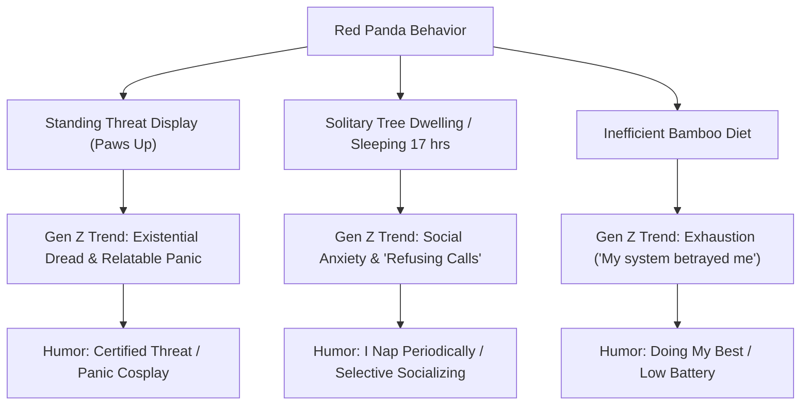

# MASTER WORKFLOW CONTEXT

## 🐸 The Seed (Animal)
**Red Panda**

---

## 🎭 Cultural Vibe
*   **Tree Goblin & Adorable Disorder**: Described in internet culture essays as a "cinnamon swirl of poor decisions and perfect eyeliner." It sits in trees, sleeps 17 hours a day, and avoids confrontation.
*   **The Relatable Threat Display (Panic Cosplay)**: The iconic behavior where they stand on their hind legs and put their paws in the air to appear large and intimidating is universally treated as a "panic cosplay" or "deeply relatable anxiety response" rather than a real warning. It is the mascot of "hands in the air like they just don't care, but actually caring because they're terrified."
*   **Solitary & Style Icon**: Highly curated appearance (perfect white eyeliner markings, fur-lined paws, a tail longer than its body used as a blanket). Known as "the patron saint of nervous girls with good outfits."
*   **Digestive Betrayal**: Classified as carnivores but surviving almost entirely on bamboo, which they cannot digest efficiently. It symbolizes "doing one's best with a system that betrayed you years ago."

---

## 🕸️ Keyword Cohesion Web


---

## 📈 Market Demand Signals
*   **Etsy Sublimation & Clipart (High Volume)**: High volume of high-intent search terms like "red panda png", "red panda sublimation png", "red panda tumbler wrap", and "red panda svg cricut" (supporting 2.6k+ reviews/sales for top digital artists).
*   **Bestseller Themes**: Retro layouts ("Three Red Panda Moon" space theme mimicking the classic three wolf moon shirt with 2.8k reviews/favorites) and watercolor/kawaii art.
*   **Proven Humor Formats**: Listings like "I came, I saw, I forgot what I was doing" and "I'm not shy, I'm just selectively social" perform exceptionally well, drawing high review volumes (500+).

---

## 📝 Phrase Templates
1.  **The Reframe (Social Anxiety / Vibe check)**:
    *   `I'm not [X], I'm just [Y]`
    *   *Example*: "I'm not aggressive, I'm just panic cosplaying" or "I'm not anti-social, I'm crepuscular."
2.  **The Bold Label (Sarcastic warning)**:
    *   `Certified [Noun] / [Sarcastic Detail]`
    *   *Example*: "CERTIFIED THREAT (Actual Size: Baguette)" or "PATRON SAINT OF NERVOUS GIRLS WITH GOOD OUTFITS."
3.  **The Rule of 3 (Lifestyle routine)**:
    *   `[Verb]. [Verb]. [Verb].`
    *   *Example*: "Hibernate. Procrastinate. Overheat." or "Sleep. Refuse Calls. Avoid Everything."

---

## 🎯 Long-Tail Opportunities
1.  **"Red Panda corporate anxiety"**: Leverages WFH/corporate burnout vibes: "I too would like to live in a tree and refuse phone calls."
2.  **"Red Panda programmer python"**: A brilliant cross-niche combining Python coding with the data science library `pandas`: `import pandas as pd` accompanied by a stressed red panda.
3.  **"Baguette-sized threat display"**: Targeting the laptop sticker / water bottle market with the paws-up threat posture labeled "Certified Threat / Danger Level: Very Low".

---

## ⚔️ Competitive Landscape Summary
*   **Top Competitors (TeePublic / Redbubble / Target)**:
    *   *ShirtBricks / AstroWolfStudio*: Focus on hyper-kawaii/chibi illustrations of red pandas eating ramen/watermelon or sleeping on branches.
    *   *NemiMakeit / BlancaVidal*: Focus on simple sarcastic slogans ("I came, I saw, I forgot", "I'm not shy, I'm just selectively social") paired with cartoon characters.
*   **Market Gaps**:
    *   No design targets the exact intersection of **coder humor** using the Python `pandas` library with the actual *red* panda.
    *   Almost no listings exploit the descriptive, self-deprecating text found in internet essays (like the "cinnamon swirl of poor decisions" or "patron saint of nervous girls").
    *   Most "threat display" art is labeled simply "Cute Red Panda" rather than playing into the "intimidating but tiny" meme format.

---

## 📊 Competitive Saturation
**Medium**
*   High quantity of generic cartoon drawings, but very low saturation of smart, high-concept, internet-native text-graphics.

---

## 🗺️ Format Route
**Shirt + Sticker**
*   *Sticker*: Perfect for the standing threat display ("Certified Threat") to put on laptops.
*   *Shirt*: Perfect for the corporate/programmer/identity reframes which require readable layout formats.

---

## 💡 Gap Opportunity
Injecting highly specific, internet-native text concepts (social anxiety reframes, programmer wordplay, essay-based tropes) into clean, high-quality vector illustrations of the red panda's most famous postures (the claws-out threat display and the tail-shrouded nap).

---

## 🏷️ Keyword Repetition Blueprint
*   **Target Main Tag**: `red panda`
*   **Blueprint Placement**:
    *   *Title*: "Funny **Red Panda** [Concept Name] T-Shirt"
    *   *Main Tag*: `red panda`
    *   *Description*: "This funny **red panda** shirt features a cute **red panda** doing a threat display..."
    *   *Tags*: `cute red panda`, `funny red panda`, `red panda sticker`, `red panda t-shirt`

---

## 🛡️ Market Intent Confidence Score
**High**
*   Excellent search visibility, strong sales indicators in digital products (DTF/PNGs), and evergreen cultural popularity on platforms like Reddit and TikTok.

---

## 🎨 Raw Concept Angles
1.  **Concept 1: The Baguette Threat**
    *   *Visual*: A crisp, retro-style vector of a fluffed-up red panda standing on its hind legs, claws out, trying to look terrifying.
    *   *Text*: "CERTIFIED THREAT" (Bold, curved collegiate arch at top) / "(Actual Size: Baguette)" (Clean sans-serif at bottom).
2.  **Concept 2: Python import pandas**
    *   *Visual*: Retro IDE style editor window.
    *   *Text*:
        ```python
        import pandas as pd
        ```
        Below it, an illustration of an extremely anxious red panda holding a laptop, wearing perfect black eyeliner, surrounded by bug/error logs.
        *Subtext*: `pd.DataFrame(existential_dread)`
3.  **Concept 3: The WFH Tree Goblin**
    *   *Visual*: A minimal line-art / color-block red panda curled up in a high tree branch, wrapping its giant tail around itself like a blanket.
    *   *Text*: "I too would like to live in a tree and refuse phone calls." (Classic vintage typewriter font).
4.  **Concept 4: Panic Cosplay**
    *   *Visual*: A red panda standing in its paws-up threat pose, but with tiny sweat droplets or nervous eyes.
    *   *Text*: "I'm not angry." / "I'm just panic cosplaying."

---

## 🎭 Phase 2: Design Concept & Prompts (Agent 2)

### 🧠 Unified Joke Statement
The joke is: a cute red panda standing on its hind legs with its paws raised high in what is biologically supposed to be a terrifying threat display, but looking comically anxious, sweaty, and completely non-threatening — the viewer laughs because its attempt at being scary is actually a highly relatable reaction of sheer panic.

### 🪝 "Me Too" Identity Hook
1. **The Human Feeling:** Existential/social anxiety, feeling overwhelmed but trying (and failing) to appear strong, in control, or intimidating.
2. **The "Why Wear It":** The wearer is signaling that they are anxious, non-confrontational, and just trying to survive under pressure, but with a humorous, self-deprecating flair.
3. **The Punchline:** A tiny, adorable red panda putting up its paws to seem like a "threat" is actually just having a panic attack, mirroring our own tiny, inconsequential daily anxieties.

### ✍️ Phrase Details
*   **Selected Phrase:** `I'M NOT AGGRESSIVE` / `I'M JUST PANIC COSPLAYING`
*   **Framework:** Confessional
*   **Register:** Delusional / Defensive
*   **Template:** `"I'm Not [X], I'm [Y]"`
*   **Length:** 7 words (Strictly under 8-word limit)
*   **Edge/Spice:** Subverts a defensive/aggressive stance into a vulnerable admission of anxiety/panic (no platitudes, passes Pinterest Test).

### 🎬 Style Choices & Sanity Check

#### 1. Hero Prop & Element Count Constraints
*   **Hero Prop:** None (0 props, minimizing clutter and AI rendering glitches).
*   **Total Elements:** 2 (Red Panda + Text).
*   **Size Constraint:** Red Panda is the largest element by area.
*   **2D Flatness Test:** Yes, the shapes are completely flat with zero perspective.

#### 2. Variety Dimensions (Emotional Paradox)
*   **Type:** Distressed delivery of wholesome content (comically anxious red panda attempting a threatening stance, paired with a vulnerable reframe).

#### 3. Expression Micro-Vocabulary
*   **Cluster:** Tired/Chaotic hybrid (one eyelid slightly lower, mouth slightly agape, one tiny cartoon sweat droplet on forehead).

#### 4. Anatomy & Stylization
*   **Style:** 70% Animal / 30% Stylization (simplified mascot body, larger head, chunky limbs).
*   **Natural Asymmetry:** Head tilted 5 degrees to the left, slightly off-balance posture.
*   **Paws/Limbs:** Thick, simple, chunky paws with short rounded claws; NO individual human fingers or toes.

#### 5. Format Selection
*   **Format:** Format D (Vertical Stack - Plea/Reframe)
*   **Text Placement:** "I'M NOT AGGRESSIVE" stacked above the mascot, "I'M JUST PANIC COSPLAYING" stacked below.

#### 6. Color Cohesion
*   **Palette:** Rusty orange, cream, and charcoal black.
*   **Text Color:** Solid cream with a black outline, matching the animal's face markings.

---

### 🖼️ Master Composition Prompt

```text
A flat screenprint-style t-shirt graphic on a transparent background of a red panda, designed as a Format D Vertical Stack. A stylized red panda with wide, anxious, distressed eyes (one eyelid slightly lower, one tiny cartoon sweat droplet on its forehead) and its mouth slightly agape, standing on its hind legs with its two front arms raised high in a defensive threat display, conveying a sense of comic panic. The red panda is frozen in a static, active gesturing threat pose. Its weight is centered but slightly off-balance, with its head tilted 5 degrees to the left. Exactly two front legs/arms are raised in the air and two short thick back legs are grounded. Front limbs are clearly separated from the torso. Thick, simple, chunky paws with short rounded claws, and absolutely NO individual human fingers or toes. No extra limbs. The text phrase "I'M NOT AGGRESSIVE" is written above the red panda, and "I'M JUST PANIC COSPLAYING" is written below it. Both text elements are written in a flat, bold retro collegiate varsity block font with a simple solid black outline. Letters are solid cream with no patterns. Text is completely separated from the subject by empty negative space. Clean negative space boundary separates the text from the graphic. The text does not wrap around, overlap, or touch the animal. Plain flat 2D lettering only, no 3D text, no 3D extrusion, no drop shadows on text, no spelling mistakes. Color palette: rusty orange, cream, and charcoal black. Flat colors only, bold color blocking, no gradients. The colors of the text match the cream color of the red panda's markings for visual harmony. Grounded simplified mascot anatomy (70% animal, 30% stylization). Thick, confident uniform black outlines. Stipple/halftone shading texture combined with visible screen print ink texture and deliberate alignment/texture imperfections to create an authentic vintage athletic screen print/patch feel. Background: TRANSPARENT. No mockup, no shirt shown, isolated graphic only, transparent background. NO PROPS. Avoid photorealism, realistic anatomy, realistic fur, over-detailed illustration, thin outlines, clean digital lines, watercolor, smooth gradients, glossy rendering. STRICTLY AVOID 3D text, 3D extrusion, drop shadows on text, isometric lettering, cursive fonts, overly melting or noodly anatomy, complex fingers/toes, mechanical props, text-heavy props, 3D props, solid background colors.
```
