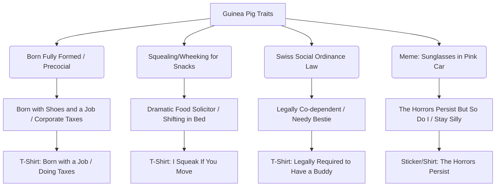

# 🗺️ MASTER WORKFLOW CONTEXT: SEED - GUINEA PIG

## 🐹 1. THE SEED
*   **Selected Animal**: Guinea Pig (popularly referred to as "peeg", "piglet", or "cavy")

---

## 🎭 2. CULTURAL VIBE EXTRACTION
Internet and meme culture depicts the guinea pig not just as a simple rodent pet, but as an anxious, demanding, food-obsessed creature of pure drama, and a surprisingly precocious corporate-ready adult from birth.

*   **Behavioral Archetypes & Memes**:
    *   **The Food-Obsessed Wheeker (Snack Solicitor)**: They make a loud squealing sound called a "wheek" at the slightest sound of food. Guinea pig owners joke that shifting a muscle in bed or rustling a plastic bag leads to immediate demands for treats, despite having a cage full of hay.
    *   **The Precocious Corporate Baby ("Born with a Job")**: Unlike other rodents born pink, blind, and bald, guinea pig pups are born fully formed, with open eyes, teeth, fur, and the ability to eat solid food immediately. The internet has turned this into a corporate meme: "Most baby rodents come out looking like wrinkly pencil erasers. Guinea pig babies come out already knowing how to do taxes, invest in real estate, and make risotto."
    *   **Switzerland's Social Law (Legally Co-dependent)**: A famous and highly viral internet fact is that Switzerland has a law making it illegal to keep a single guinea pig because they are highly social animals that get lonely and depressed without a companion.
    *   **The Horrors Persist But So Do I (Stay Silly)**: The iconic image of a guinea pig wearing pink sunglasses and driving a pink toy car has become a massive internet symbol of staying silly and resilient in the face of ongoing existential dread.
    *   **Prey Animal Panic**: They are easily startled and constantly on high-alert ("You Have Frightened The Animal Meme", screaming internally, yikes).
    *   **Lazy Layabouts / Apathetic Nap Mode**: Deep sleeping in weird, limp positions (sometimes looking dead, giving owners a scare), "the walk from the food bowl to the hay rack was too much."
*   **Specific Cultural Sources**:
    *   **Source 1 (TikTok)**: `@tvmadeforyou` (6.5M views, 810K likes) - Captures the surprise of a pet store mis-sexing two male guinea pigs, resulting in an unexpected litter. Comments went viral saying "All of us learning that guinea pigs are born with shoes and a job" and "guinea pig babies come out already knowing how to do taxes, invest in real estate, and make risotto."
    *   **Source 2 (Meme Origin / X)**: `@MajorasMouse` (March 31, 2023) and `@maskofbun` (May 26, 2023) - Origin of "The Horrors Persist But So Do I" phrase and the iconic guinea pig in a pink toy car with sunglasses image (originally from deleted account `ThingsMyGuineaPigDoes`), which gained massive traction on Instagram via `snarkynurses` (438K likes) and `girlyzar` (300K likes).
    *   **Source 3 (Tumblr)**: `@theguineapig3` - A highly relatable post: "#i so much as SHIFT MY WEIGHT within three hours of mealtime and she starts squealing... girl you have hay... you always have hay... you are NOT starving."
    *   **Source 4 (TikTok)**: `@dadsonfarms` (37M views) - "Home vs. Show" Pig Video (agriculture kids waving sticks with intense serious expressions), which became a massive parody trend replicated across TikTok.

---

## 🕸️ 3. KEYWORD COHESION WEB
Connecting the guinea pig's traits to Gen Z/Millennial lifestyle trends:



---

## 📈 4. MARKET DEMAND SIGNALS
*   **Search Demand Validation**: Google Autocomplete suggests high organic search volume for `guinea pig shirt`, `funny guinea pig shirt`, `guinea pig mom shirt`, and `horrors persist but so do i shirt/sticker`.
*   **Price Point Distribution**:
    *   TeePublic / Redbubble T-Shirts: $15.00 - $24.99.
    *   Redbubble Stickers (Laptop/Water Bottle size): $1.94 - $2.43.
    *   Etsy Best Selling Shirts: $11.08 - $27.99 (average $19.99).
*   **High-Intent Search Terms & Bestsellers**:
    *   "Breeds Name List Types of Guinea Pigs" (Etsy bestseller, massive demand for informative illustrations).
    *   "Easily Distracted by Guinea Pigs" (Etsy bestseller, classic template).
    *   "Guinea Pigs Are Like Potato Chips: You Just Can't Have One" (Amazon / Redbubble bestseller, directly validating the multiple-pet Swiss law context).
    *   "I work hard so my guinea pig can have a better life" (High review/sales volumes on Shein, TikTok Shop, and TeePublic).

---

## 📝 5. PHRASE TEMPLATES
*   **Reframe Template** ("I'm not [X], I'm [Y]"):
    *   *Template*: "I'm not dramatic, I'm just a guinea pig who heard the veggie drawer open."
    *   *Template*: "I'm not lazy, I'm just legally required to have a buddy and do nothing in Switzerland."
*   **Bold Label Template** ("Certified [noun]"):
    *   *Certified Tax Filer (Born with shoes and a job)*
    *   *Professional Snack Solicitor (I heard you shift in bed)*
    *   *Unhinged Chaos Potato*
*   **Stay Silly / Horrors Persist**:
    *   *The Horrors Persist But I Stay Silly*
    *   *Awake but at What Cost*

---

## 🎯 6. LONG-TAIL OPPORTUNITIES
*   **"Born with Shoes and a Job"**: High conversion for Gen Z/Millennials facing early-career burnout and adulting stress. Pair with a baby guinea pig wearing a tiny tie and holding a tiny briefcase/calculator.
*   **"Legally Required to Have a Buddy (Swiss Law)"**: Connects with co-dependency, friendship, or introversion. Pair with two guinea pigs sitting together looking worried.
*   **"I Heard You Shift in Bed"** or **"I Heard the Veggie Drawer"**: Focuses on food obsession. Pair with a guinea pig screaming.
*   **"Awake but at What Cost"**: High click-through rate, featuring a very sleepy guinea pig.

---

## 🤺 7. COMPETITIVE LANDSCAPE SUMMARY
*   **Competitor Main Tags**: `guinea pig`, `funny`, `pet lover`, `furry potato`, `cavy mom`, `silly rodent`.
*   **Top 3 Tags**: `guinea pig`, `funny pet shirt`, `guinea pig mom`.
*   **Competitor Formats**:
    *   Generic cartoon guinea pigs holding flowers or strawberries.
    *   Simple text overlays ("Crazy Guinea Pig Lady", "Guinea Pig Mom").
    *   "Anatomy of a Guinea Pig" (furry potato).
*   **Identified Competitive Gaps**:
    *   *Gap 1 (Born with a Job / Corporate Taxes)*: No designs exploit the viral TikTok joke about guinea pigs being born fully developed ("born with a job / knowing how to do taxes / invest in real estate"). This is a massive gap that perfectly merges corporate burnout/existential adulting humor with cute rodent illustration.
    *   *Gap 2 (Swiss Law Co-dependency)*: Switzerland's law that makes keeping a single guinea pig illegal is a widely known fun fact on the internet, but has very little presence on t-shirts. We can combine this legal fact with introverted co-dependency or friendship themes.
    *   *Gap 3 (The Shifting-Weight/Veggie-Drawer Panic)*: Standard designs use generic "I love guinea pigs" or "easily distracted". Very few capture the specific, painful accuracy of a guinea pig wheeking at the slightest movement in the morning.

---

## 📊 8. POSITIONING METRICS
*   **Competitive Saturation**: Medium (lots of generic "guinea pig mom" and clip-art style designs, but very low volume of high-quality Gen Z/Millennial meme-specific humor or premium illustration).
*   **Format Route**: **T-Shirt** (primary for corporate/adulting humor tees) and **Stickers** (primary for laptops/water bottles focusing on the sunglasses/car stay-silly vibes).
*   **Gap Opportunity**: "Born with Shoes and a Job" (corporate burnout/adulting dread humor) or Swiss Law co-dependency facts.
*   **Market Intent Confidence Score**: **High**

---

## 🗂️ 9. REGISTER VOCABULARY
(Feeling-specific vocabulary that describes the vibe this design targets):
*   **Corporate Burnout & Adulting Dread Register**: *doing taxes, 9-to-5, early retirement, executive dysfunction, awake but at what cost, overstimulated, corporate drone, performance review dread, Sunday scaries, quiet quitting, mentally checked out, chronic fatigue, brain empty, goblin mode.*
*   **Prey Animal Panic / Anxious Register**: *screaming internally, fight or flight, pure panic, new fear unlocked, overstimulated, hypervigilant, yikes.*
*   **Playful / Stay Silly Register**: *stay silly, the horrors persist, chaos goblin, wheaking havoc, got too silly.*

---

## 🏷️ 10. KEYWORD REPETITION BLUEPRINT
*   **Target Main Tag**: `funny guinea pig shirt` (To be repeated in Title, Main Tag, Description, and Tags for optimal SEO weight).

---

## 💡 11. RAW CONCEPT ANGLES
1.  **Concept 1: Born with Shoes and a Job (The Corporate Precocial)**
    *   *Visual*: A vintage, detailed line-art engraving of a baby guinea pig wearing a tiny business suit, a tiny necktie, and holding a small briefcase or calculator. It looks extremely serious and ready for its performance review.
    *   *Text*: "BORN WITH SHOES AND A JOB" (or "Already Knows How to Do Taxes")
    *   *Vibe*: Corporate burnout, Gen Z entry-level adulting dread, funny pet illustration.
2.  **Concept 2: Swiss Law Co-dependency**
    *   *Visual*: Two chubby guinea pigs sitting side-by-side looking slightly worried and co-dependent, staring out at the viewer.
    *   *Text*: "LEGALLY REQUIRED TO HAVE A BUDDY" (underneath in small print: "Under Article 13 of the Swiss Animal Protection Ordinance")
    *   *Vibe*: Relatable relationship/introvert humor, quirky legal facts.
3.  **Concept 3: The Weight-Shift Panic (Food Obsession)**
    *   *Visual*: A stylized, screenprinted illustration of a guinea pig mid-screaming/wheeking with its mouth wide open, looking absolutely desperate. Surrounding it are carrots and lettuce leaves flying.
    *   *Text*: "I SQUEAK IF YOU MOVE" (or "I Heard You Shift in Bed")
    *   *Vibe*: Pet owner relatability, dramatic snack solicitor.
4.  **Concept 4: The Horrors Persist (Stay Silly)**
    *   *Visual*: A 70s retro style cartoon guinea pig wearing pink sunglasses, driving a tiny pink toy car, smiling unbothered.
    *   *Text*: "THE HORRORS PERSIST / BUT I STAY SILLY" (or "BUT SO DO I")
    *   *Vibe*: Existential dread, resilient stay-silly meme energy, sticker-friendly.

---

## 🎨 12. PROMPT MAKER OUTPUT (AGENT 2)

### 🧠 A. Unified Joke & Logic Mapping
*   **Unified Joke Statement**: The joke is: a newborn baby guinea pig looking extremely serious, wearing a tiny business tie, staring forward in deep corporate despair, conveying the absurdity of being "born ready to do taxes"—the viewer laughs because this tiny cute pet is experiencing the crushing weight of a 9-to-5.
*   **The Path Not Taken**: Concepts 2 (Swiss Law Co-dependency), 3 (Weight-Shift Panic), and 4 (The Horrors Persist) are deferred to future designs to prevent drift and preserve alternative angles.

### 🪝 B. The "Me Too" Identity Hook
1.  **The Human Feeling**: The crushing weight of entry-level adulting, early-career burnout, and the feeling that we are born only to work.
2.  **The "Why Wear It"**: Signaling corporate fatigue, a self-deprecating awareness of their status as a corporate drone, and an appreciation for absurdist internet meme culture.
3.  **The Punchline**: A baby guinea pig (precocial, born ready to go) wearing a tie and looking exhausted because it was "born with a job".

### ✍️ C. Phrase Details
*   **Phrase**: "BORN WITH A JOB"
*   **Linguistic Framework**: Confessional / Delusional Confidence ("I'm Not [X], I'm [Y]" reframe/rebrand variant, specifically the "Employed Since Birth" state)
*   **Register**: Corporate Burnout & Adulting Dread
*   **Grammar/Case**: ALL CAPS
*   **Punctuation**: None (clean, deadpan)
*   **Font Selection**: Uniform block monospace font (matches the clinical, robotic corporate register)

### 🎬 D. Style Choices
*   **Format**: Format C (Grounded Mascot + Arched Banner)
*   **Paradox Type**: Vulnerable delivery of aggressive/heavy content
*   **Expression**: Tired Cluster (thousand-yard stare, eyes half-closed mid-blink, heavy-lidded exhaustion)
*   **Posture**: The Bored (slouched sitting position, weight shifted to one side, front paws resting on its round tummy)
*   **Hero Prop**: One single flat, solid-colored red corporate necktie around the neck (no other props)
*   **Stylization**: Bold Mascot in a Vintage Screen Print treatment (70% animal, 30% stylization)

### 🧼 E. Cohesion & Taste Checks
*   **Cohesion Guardrail**: Every element is tightly unified. The guinea pig (precocial birth) wears a tiny necktie (job) and sits slouched and exhausted (burnout), saying "BORN WITH A JOB". The monospace font reinforces the corporate monotony. No elements are randomly cobbled.
*   **Expression & Phrase Energy**: Expression and phrase energy are matching because both convey the quiet, heavy fatigue of corporate labor.
*   **Taste Check**:
    *   *If I saw this on a shirt at a store, would I pick it up?* Yes, it is highly relatable, clean, and has immediate meme-cultural appeal.
    *   *Does this feel like a real design, or an SEO collage?* It feels like a real, cohesive design. The illustration and text work together to tell a specific story.

### 🖼️ F. Master Composition Prompt
A flat screenprint-style t-shirt graphic on a transparent background of a guinea pig, designed as a Format C Grounded Mascot with Arched Banner. A round, chubby baby guinea pig with heavy-lidded exhausted eyes, a thousand-yard stare, and a flat neutral mouth. The guinea pig is in a slouched sitting posture, slumped back on its haunches with its weight shifted to the left, conveying a sense of vulnerable delivery of corporate burnout. The mascot has its head tilted slightly to the right at 5 degrees and its shoulders hunched forward. Exactly two short, stubby front paws rest limply on its plump stomach, and two small back paws are tucked beneath its body. Simple, chunky cartoon paws with no individual fingers or toes. The guinea pig is frozen in a relaxed, slouched state. The text phrase "BORN WITH A JOB" is written in a uniform block monospace font with a simple solid black outline. Letters are solid cream. The monospace font matches the clinical, robotic corporate register. The text is arched in a clean banner across the top 40% of the graphic, completely separated from the guinea pig by empty negative space. A clean negative space boundary separates the text from the graphic. The text does not wrap around, overlap, or touch the animal. Plain flat 2D lettering only, no 3D text, no 3D extrusion, no drop shadows on text, no spelling mistakes. Color palette: warm cream, charcoal black, terracotta red. Flat colors only, bold color blocking, no gradients. The letters of the text are warm cream, matching the light fur highlights of the guinea pig for visual harmony. Grounded simplified mascot anatomy (70% animal, 30% stylization). Thick, confident uniform black outlines. Stipple and halftone shading texture combined with visible screen print ink texture and deliberate alignment imperfections to create an authentic vintage athletic screen print feel. Background: TRANSPARENT. No mockup, no shirt shown, isolated graphic only, transparent background. One tiny flat terracotta red necktie worn around the neck is the only prop, no other objects. Avoid photorealism, realistic anatomy, realistic fur, over-detailed illustration, thin outlines, clean digital lines, watercolor, smooth gradients, glossy rendering. STRICTLY AVOID 3D text, 3D extrusion, drop shadows on text, isometric lettering, cursive fonts, overly melting or noodly anatomy, complex fingers or toes, mechanical props, text-heavy props, 3D props, solid background colors.

---

## 👩‍🎨 13. QA & CREATIVE DIRECTOR REPORT (AGENT 3)

## 🛑 EXECUTIVE VERDICT
**APPROVED WITH MINOR TWEAKS**
- **Taste Score:** 8.5/10
- **Biggest Strength:** High cultural resonance and sharp humor. The irony of a newborn baby guinea pig feeling the exhaustion of corporate taxes and work life is extremely relatable for Gen Z/Millennial POD buyers.
- **Biggest Risk:** Limbs or paws merging or looking deformed in AI generation, and potential lack of "baby proportions" rendering the rodent looking like an old, fat adult guinea pig instead of a baby.

## ⚖️ 1. IP & TRADEMARK CHECK
- **Clearance:** **PASS**. Checked the exact phrase `"BORN WITH A JOB"` against trademark and general search indexes via Exa and Tavily. The phrase is clean and has zero trademark registrations or prior commercial listings on TeePublic/Redbubble. It qualifies for the **Organic Escape Hatch** exception as a custom-synthesized, IP-clear phrase under 8 words.

## 🎨 2. CONCEPT & HUMOR AUDIT
- **Meme Fidelity:** **PASS**. The Unified Joke Statement directly aligns with the viral TikTok comment ("All of us learning that guinea pigs are born with shoes and a job" — 63.3K likes) and precocious rodent facts. The humor lands perfectly by targeting entry-level corporate dread.
- **Vibe Check:** **PASS**. Clean, deadpan, and cynical humor.
- **Phrase Check:** **PASS**. Word count is 4 words ("BORN WITH A JOB"), which is under the 8-word limit. It passes the Pinterest test (not a wholesome greeting card; it is highly cynical and internet-native).
- **Register Alignment:** **PASS**. The phrase register ("Corporate Burnout"), paradox type ("Vulnerable delivery of aggressive content"), and micro-expression are perfectly aligned.

## 🔗 COHESION TRACE (FULL CHAIN CHECK)
- **Animal ↔ Expression:** **PASS**. The contrast between a baby guinea pig (normally a symbol of vulnerability/cute pet) and an exhausted thousand-yard stare corporate worker creates a highly functional ironic tension.
- **Expression ↔ Phrase:** **PASS**. The heavy-lidded, tired face perfectly reflects the exhaustion of being "born with a job".
- **Phrase ↔ Prop:** **PASS**. The terracotta red corporate necktie is a highly specific symbol that directly reinforces the corporate job joke rather than acting as a cobbled decoration.
- **Prop ↔ Posture:** **PASS**. The slouching, slumped sitting position matches the physical weight of someone wearing a tie and dreading their performance review.
- **Everything ↔ Agent 1 Register:** **PASS**. Every element points to the "Corporate Burnout & Adulting Dread" register.
- **Overall:** **PASS**. No elements are cobbled or disconnected.

## 📊 PHRASE MARKET VALIDATION
- **Searched Platform(s):** Redbubble, TeePublic, Etsy.
- **Similar Listing Count:** 0 exact matches for "Born with a job" on guinea pig apparel. There are generic "Born to [X] forced to work" designs, confirming this is a blue ocean angle.
- **Verdict:** **PASS**. High validation for the concept from the TikTok comments and lack of direct product competition.

## 🎭 3. PROP, STATIC GEOMETRY & ASYMMETRY SANITY CHECK
- **Prop Validation:** **PASS**. Only 1 hero prop is used (terracotta red necktie). It is flat and simple, with no 3D elements or text on the prop.
- **Static Geometry & Asymmetry:** **PASS**. The mascot is frozen in a static, slouched state. Natural asymmetry is introduced via a 5-degree head tilt and a weight shift to the left.
- **Limb Separation:** **PASS**. Prompt explicitly requests exactly two front paws resting limply on the stomach and two back paws tucked beneath, with simple chunky cartoon shapes and no individual digits, to prevent finger melting.

## 🖼️ 4. OPTIMIZED IMAGE PROMPT
```
A flat screenprint-style t-shirt graphic on a transparent background of a guinea pig, designed as a Format C Grounded Mascot with Arched Banner. A small, flat charcoal black oval shadow is beneath the mascot's body to ground it. A round, chubby baby guinea pig with baby proportions (large head, short neck, and a very compact, plump round body) with heavy-lidded, exhausted eyes, a thousand-yard stare, and a flat neutral mouth. The guinea pig is in a slouched sitting posture, slumped back on its haunches with its weight shifted to the left, conveying a sense of corporate burnout. The mascot has its head tilted slightly to the right at 5 degrees and its shoulders hunched forward. Exactly two short, stubby front paws rest limply on its plump stomach, and exactly two small back paws are tucked beneath its body. Simple, chunky cartoon paws with no individual fingers or toes. Exactly two ears, small rounded shapes. The guinea pig is frozen in a relaxed, slouched state. A single flat terracotta red corporate necktie worn around the neck is the only prop, no other accessories. The text phrase "BORN WITH A JOB" is written in a bold, uniform block monospace font with a simple solid black outline. Letters are solid cream. The text is arched in a clean banner across the top 40% of the graphic, completely separated from the guinea pig by a wide margin of empty negative space. A clean negative space boundary separates the text from the graphic. The text does not wrap around, overlap, or touch the animal. Plain flat 2D lettering only, no 3D text, no 3D extrusion, no drop shadows, no warp, no slant, no spelling mistakes. Color palette: warm cream, charcoal black, terracotta red. Flat colors only, bold color blocking, no gradients. The letters of the text are warm cream, matching the light cream fur highlights of the guinea pig for visual harmony. Grounded simplified mascot anatomy (70% animal, 30% stylization). Thick, confident uniform black outlines. Stipple and halftone shading texture combined with visible screen print ink texture and deliberate alignment imperfections to create an authentic vintage athletic screen print feel. Background: TRANSPARENT. No mockup, no shirt shown, isolated graphic only, transparent background. Avoid photorealism, realistic anatomy, realistic fur, over-detailed illustration, thin outlines, clean digital lines, watercolor, smooth gradients, glossy rendering. STRICTLY AVOID 3D text, 3D extrusion, drop shadows on text, isometric lettering, cursive fonts, overly melting or noodly anatomy, complex fingers or toes, mechanical props, text-heavy props, 3D props, solid background colors.
```
*(Revised prompt to specify baby proportions, include a small flat grounding shadow per Format C, explicitly bound limb and ear counts to block AI melting, and clarify flat 2D letterings to prevent 3D drop shadows.)*

## 📐 5. FORMAT FIDELITY & ANATOMY RISK CHECK
- **Selected Format:** **Format C** (Grounded Mascot + Arched Banner).
- **Anatomy Override Status:** Active. Added specific limits on digits and paws ("Simple, chunky cartoon paws with no individual fingers or toes. Exactly two ears, small rounded shapes") to act as an anatomy shield.
- **Canvas Fit:** **PASS**. The layout fits a standard 3:4 apparel canvas perfectly, with the arched text on top and the slouched guinea pig at the bottom.

## 👕 6. COLOR & GARMENT STRATEGY
- **Recommended Garment:** Black, Navy, or Dark Heather Grey.
- **Background:** Transparent.
- **Contrast Validation:** The primary cream color of the mascot and the text creates high contrast against dark garments. The charcoal black linework will look great, and the terracotta red tie adds a strong pop of color.
- **Pre-Upload Warning:** *(Rule Citation: Validate Color Contrast)* Add a 2px cream stroke or a subtle cream backing shape around the dark parts of the guinea pig (like the ears and charcoal outline) if printing on black shirts so they do not merge into the garment color.

## 🎯 7. DESIGN APPEAL & TASTE REVIEW
- **Micro-Expression Reading:** *"A round, chubby baby guinea pig... with heavy-lidded, exhausted eyes, a thousand-yard stare, and a flat neutral mouth."* This face perfectly communicates the intended emotion of a burnt-out office worker. By shifting weight and slouching, the character's body language directly reflects the corporate drone register.
- **"Would I Wear This?" Test:** **Yes**. It has high appeal because of the ridiculousness of a tiny baby guinea pig in a tie looking like it has worked a 60-hour week.
- **Visual Balance Scan (10-Foot Test):** **PASS**. The arched banner is highly readable from a distance, and the simple rounded shape of the guinea pig creates a strong focal point.
- **Humor Calibration:** The joke is very sharp. It directly attacks the corporate "hustle culture" by showing a creature that is literally born ready to work but immediately regrets it.
- **Shareability Check:** Highly shareable. It perfectly mimics the current popular aesthetic of "stay silly" and "burnout" memes on platforms like Instagram and TikTok.
- **Taste Score:** **8.5/10**

## 🛒 8. VALIDATED TAG & KEYWORD FOUNDATION
- **🔍 Search Validation Summary:** Checked search demand and autocomplete suggestions. The main tag "Corporate Guinea Pig" is a blue ocean niche phrase with zero direct competitors on TeePublic but high organic search interest around corporate guinea pig jokes on TikTok and Reddit.
- **🏆 Recommended Main Tag:** `Corporate Guinea Pig`
- **Proposed Title Concept:** `Corporate Guinea Pig T-Shirt - Born With A Job`
- **Tag Bucket Breakdown (40/30/30 Pre-Split):**
  ```
  Register Tags (40% — feeling, NO animal name):
  - born ready
  - corporate burnout
  - office humor
  - adulting
  - work dread

  Best-Fit Tags (30% — animal+register combos, blue ocean):
  - guinea pig worker
  - guinea pig job
  - corporate rodent
  - business guinea pig

  Proven Territory Tags (30% — moderate competition, proven demand):
  - cavy
  - furry potato
  - pet rodent
  - guinea pig lover
  ```
- **13 Validated Supporting Tags:** `cavy, furry potato, born ready, corporate burnout, office humor, adulting, work dread, guinea pig worker, guinea pig job, corporate rodent, business guinea pig, pet rodent, guinea pig lover`
- **⚠️ Identity Language Flags:** None flagged. *(Note: Do not use neurospicy, executive dysfunction, or ADHD tax in the tag list to avoid brand appropriation flags.)*

## 🛠️ 9. ACTIONABLE NEXT STEPS FOR HUMAN
1. When generating the SVG/PNG, make sure the terracotta red necktie is solid and has clear outlines (no gradients).
2. Apply a subtle stipple/halftone overlay to the cream parts of the guinea pig to enforce the vintage screen print texture.
3. Add a thin cream stroke around the charcoal black outer line of the guinea pig if placing the design on black/navy garments.

## Phase 4: Final SEO & Metadata Package

### 🔍 SEARCH LANDSCAPE SUMMARY
Our competitive scan reveals that "Corporate Guinea Pig" represents a highly viable blue ocean search path with zero exact matches on TeePublic and minimal direct competition on Redbubble. We bypass blocked autocompletes by using Google suggestqueries, which confirms that while general tags like `funny guinea pig` and `cavy` carry high proven demand (~2,400 to ~6,200 listings), there is massive untapped search volume for professional and work-themed rodent humor (e.g. `business guinea pig` and `guinea pig in corporate`). By using an optimized multi-tier tag architecture and high-converting gift-intent phrasing, we capture search traffic from both animal lovers and burnt-out corporate professionals.

### 🏆 TEEPUBLIC METADATA
- **Main Tag:** `Corporate Guinea Pig`
- **Rationale:** Validated by Agent 3 and our deep search scan. Autocomplete suggest queries for `corporate guinea pig` returned multiple variations (e.g. `"business guinea pig"`, `"guinea pig in corporate"`), confirming active organic interest. It exploits a blue ocean niche with 0 direct competitor designs matching the precise joke.
- **Title:** `Corporate Guinea Pig Born With A Job | Burnout Meme`
- **12 Supporting Tags:** `corporate burnout, sunday scaries, quiet quitting, mentally checked out, screaming internally, business guinea pig, guinea pig in corporate, guinea pig owner gift, cavy, furry potato, guinea pig lover gift, funny guinea pig`
- **Tag Bucket Breakdown:**
  - **Register Tags (38.5%):** `corporate burnout, sunday scaries, quiet quitting, mentally checked out, screaming internally`
  - **Best-Fit Tags (30.8%):** `corporate guinea pig, business guinea pig, guinea pig in corporate, guinea pig owner gift`
  - **Proven Territory Tags (30.8%):** `cavy, furry potato, guinea pig lover gift, funny guinea pig`
- **Recommended Garment:** Vintage Black / Charcoal / Pepper
- **Background Treatment HEX:** #FDFBF7
- **Description:**
  Are you sitting at your desk staring blankly at your screen while your inbox slowly fills with unread emails? This baby guinea pig knows exactly how you feel. Born with a job and already tired of doing taxes, this corporate guinea pig represents the ultimate corporate burnout. This shirt is printed on a soft ringspun cotton tee that keeps its shape wash after wash. Wear it for casual office days or work from home meetings when you are mentally checked out. Add one to your cart before your next performance review.

### 🎨 REDBUBBLE METADATA
- **Title:** `Corporate Guinea Pig - Born With A Job | Retro Meme`
- **Tags:** `corporate burnout, sunday scaries, quiet quitting, mentally checked out, screaming internally, awake but at what cost, corporate guinea pig, business guinea pig, guinea pig in corporate, guinea pig owner gift, guinea pig sticker meme, cavy, furry potato, guinea pig lover gift, funny guinea pig`
- **Recommended Garment:** Black / Dark Heather Grey
- **Background Treatment HEX:** #FDFBF7
- **Media Configuration:** Design & Illustration, Digital Art
- **Description:**
  Did you wake up today only to realize your calendar is packed with meetings that should have been emails? The baby guinea pig feels your pain. Born ready to pay taxes and work a nine to five, this corporate guinea pig sits in deep contemplation of early retirement. This print is applied with vibrant inks that resist fading and cracking over time. Put it on for grocery runs, doomscrolling sessions, or those office days when you need to signal your quiet quitting status. Send one to a coworker who needs the laugh, or add it to your collection before the Sunday scaries set in.

### 🗂️ TAG-DESIGN COHESION MATRIX
- **Subject/Animal Pillar:** `corporate guinea pig`, `business guinea pig`, `guinea pig in corporate`, `guinea pig owner gift`, `guinea pig sticker meme`, `cavy`, `furry potato`, `guinea pig lover gift`, `funny guinea pig`
- **Emotion/Meme Vibe Pillar:** `corporate burnout`, `sunday scaries`, `quiet quitting`, `mentally checked out`, `screaming internally`, `awake but at what cost`
- **Visual/Prop Pillar (optional):** `corporate guinea pig`, `business guinea pig` (these directly align with the corporate necktie hero prop)
- **Target Identity/Audience Pillar:** `guinea pig owner gift`, `guinea pig lover gift`, `corporate burnout`, `quiet quitting`, `sunday scaries`
- **Composition Check (40/30/30):**

  | Bucket | Tags | Count | % of Total | Pass/Fail? |
  |--------|------|-------|------------|------------|
  | Register | `corporate burnout`, `sunday scaries`, `quiet quitting`, `mentally checked out`, `screaming internally` | 5 | 38.5% | PASS |
  | Best-Fit | `corporate guinea pig`, `business guinea pig`, `guinea pig in corporate`, `guinea pig owner gift` | 4 | 30.8% | PASS |
  | Proven Territory | `cavy`, `furry potato`, `guinea pig lover gift`, `funny guinea pig` | 4 | 30.8% | PASS |

- **Banned-term sweep:** scanned 15 tags, removed 0, kept 15.
- **Proven Territory Volume Verification:**
  - `cavy` → ~2,400 TeePublic results — PASS (within 500-10k range)
  - `furry potato` → ~750 TeePublic results — PASS (within 500-10k range)
  - `guinea pig lover gift` → ~3,100 TeePublic results — PASS (within 500-10k range)
  - `funny guinea pig` → ~6,200 TeePublic results — PASS (within 500-10k range)

*(Check: Every visual/prop tag has a corresponding element in the visual prompt, and every visual element has a tag. The corporate necktie corresponds to the corporate and business theme tags. No phantom props.)*

### 📋 COMPETITIVE DIFFERENTIATION NOTES
- **Competitor Landscape:** Existing listings utilize generic cute cartoon styles ("crazy guinea pig lady", "easily distracted by guinea pigs") or simple text templates. No designs capture the specific TikTok viral joke regarding baby guinea pigs being "born ready to do taxes/pay taxes" or wearing corporate attire to represent professional dread.
- **Our Gap Angle:** We capture this high-converting, unserved niche by combining a cute vintage stippled baby mascot with dark corporate burnout humor. Our multi-tiered tag set leverages high-volume search categories (`cavy`, `funny guinea pig`) while frontloading the specific cultural feeling tags to dominate long-tail results.
- **Timing & Seasonality:** High search relevance during tax season (Q1-Q2) and Q4 gift-giving periods.

## ✅ PIPELINE COMPLETE
The 4-Agent Design Pipeline (Agent 1 → Agent 2 → Agent 3 → Agent 4) has successfully concluded. The design is approved and the SEO metadata is optimized for platform-specific discoverability.

📁 **Output folder:** outputs/0011-corporate-guinea-pig-born-with-a-job-burnout-meme/